# :zap: **Jarkom-Modul-2-ITB01-2022** :zap:

| Nama                               | NRP            |
|------------------------------------|----------------|
| 	:adult: Rafael Nixon              | 05311940000025 |
| 	:adult: Fairuz Azka Maulana       | 5027201017     |
| 	:adult: Muhammad Firdho Kustiawan | 5027201005     | 
<br/>


## :large_blue_circle: **Topologi Jaringan** :large_blue_circle: 
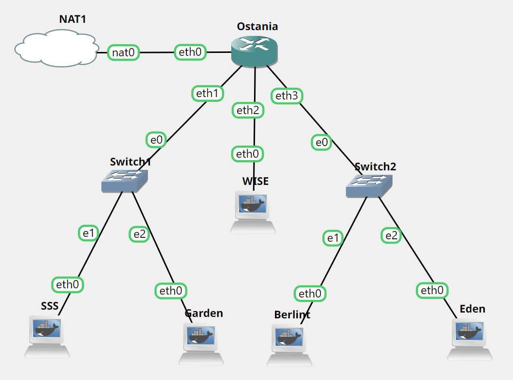
<br>

## :large_blue_circle: **Soal 1** :large_blue_circle: 
WISE akan dijadikan sebagai DNS Master, Berlint akan dijadikan DNS Slave, dan Eden akan digunakan sebagai Web Server. Terdapat 2 Client yaitu SSS, dan Garden. Semua node terhubung pada router Ostania, sehingga dapat mengakses internet (1).

### :triangular_flag_on_post: **Jawaban:**
Kami melakukan konfigurasi pada setiap node yang ada pada topologi tersebut.

### :rocket: **Ostania**
```JavaScript
auto eth0
iface eth0 inet dhcp

auto eth1
iface eth1 inet static
      address 10.45.1.1
      netmask 255.255.255.0

auto eth2
iface eth2 inet static
      address 10.45.2.1
      netmask 255.255.255.0

auto eth3
iface eth3 inet static
      address 10.45.3.1
      netmask 255.255.255.0
```

### :rocket: **WISE**
```JavaScript
auto eth0
iface eth0 inet static
      address 10.45.2.2
      netmask 255.255.255.0
      gateway 10.45.2.1
```

### :rocket: **SSS**
```JavaScript
auto eth0
iface eth0 inet static
      address 10.45.1.2
      netmask 255.255.255.0
      gateway 10.45.1.1
```

### :rocket: **Garden**
```JavaScript
auto eth0
iface eth0 inet static
      address 10.45.1.3
      netmask 255.255.255.0
      gateway 10.45.1.1
```

### :rocket: **Berlint**
```JavaScript
auto eth0
iface eth0 inet static
      address 10.45.3.2
      netmask 255.255.255.0
      gateway 10.45.3.1
```

### :rocket: **Eden**
```JavaScript
auto eth0
iface eth0 inet static
      address 10.45.3.3
      netmask 255.255.255.0
      gateway 10.45.3.1
```

Kemudian kami manjalankan command berikut di Ostania
```JavaScript
iptables -t nat -A POSTROUTING -o eth0 -j MASQUERADE -s 10.45.0.0/16
```

Setelah itu kami mencari IP DNS dari Ostania dengan command `cat /etc/resolv.conf`
```JavaScript
nameserver 192.168.122.1
```

Memasukkan command `echo nameserver 192.168.122.1 > /etc/resolv.conf` di setiap node untuk testing secara umum apakah setiap node sudah terhubung dengan google

### :white_check_mark: **Testing WISE**
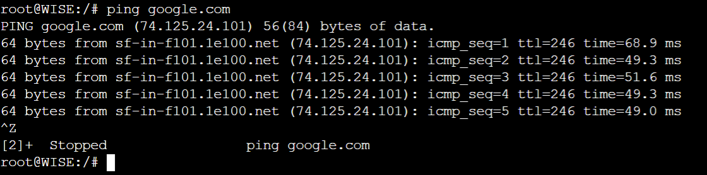

### :white_check_mark: **Testing SSS**
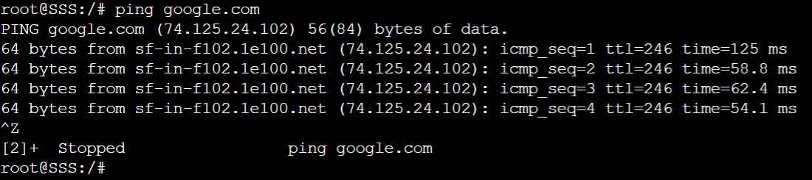

### :white_check_mark: **Testing Garden**
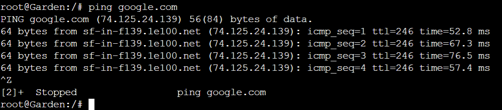

### :white_check_mark: **Testing Berlint**
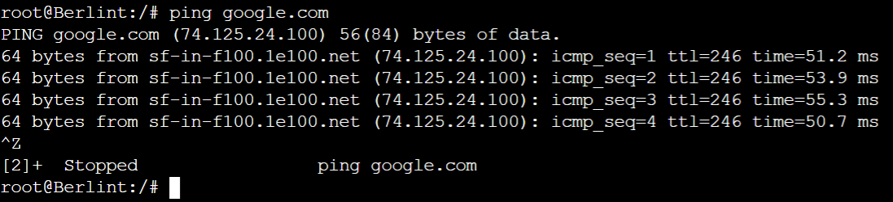

### :white_check_mark: **Testing Eden**
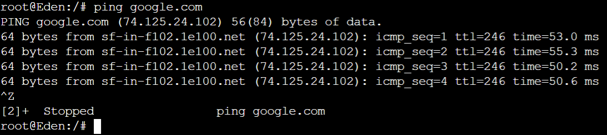
<br>

## :large_blue_circle: **Soal 2** :large_blue_circle: 
Untuk mempermudah mendapatkan informasi mengenai misi dari Handler, bantulah Loid membuat website utama dengan akses wise.yyy.com dengan alias www.wise.yyy.com pada folder wise (2).

### :triangular_flag_on_post: **Jawaban:**

### :rocket: **WISE**
WISE merupakan DNS Master sehingga konfigurasi dilakukan di WISE. Pertama-tama kami mengupdate package terlebih dahulu kemudian menginstal bind9

```JavaScript
apt-get update
apt-get install bind9 -y
```

Kemudian melakukan konfigurasi terhadap file ` /etc/bind/named.conf.local`  
```JavaScript
zone "wise.itb01.com" {  
        type master;  
        file "/etc/bind/wise/wise.itb01.com";
};
```

Membuat folder 
```JavaScript
mkdir /etc/bind/wise
```

Mengcopy isi file db.local ke ` /etc/bind/wise/wise.itb01.com`
```JavaScript
cp /etc/bind/db.local /etc/bind/wise/wise.itb01.com
```

Melakukan konfigurasi terhadap file `/etc/bind/wise/wise.itb01.com`
```JavaScript
$TTL    604800
@       IN      SOA     wise.itb01.com. root.wise.itb01.com. (
                       20221025         ; Serial
                         604800         ; Refresh
                          86400         ; Retry
                        2419200         ; Expire
                         604800 )       ; Negative Cache TTL
;
@       IN      NS      wise.itb01.com.
@       IN      A       10.45.2.2
@       IN      AAAA    ::1
```

Merestart bind9
```JavaScript
service bind9 restart
```

Kemudian untuk membuat CNAME maka dilakukan konfigurasi kembali di file `/etc/bind/wise/wise.itb01.com`
```JavaScript
$TTL    604800
@       IN      SOA     wise.itb01.com. root.wise.itb01.com. (
                       20221025         ; Serial
                         604800         ; Refresh
                          86400         ; Retry
                        2419200         ; Expire
                         604800 )       ; Negative Cache TTL
;
@       IN      NS      wise.itb01.com.
@       IN      A       10.45.2.2
www     IN      CNAME   wise.itb01.com.
@       IN      AAAA    ::1
```

Merestart bind9
```JavaScript
service bind9 restart
```

### :white_check_mark: **Testing di SSS**

```JavaScript
ping www.wise.itb01.com
```

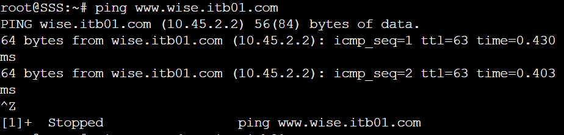
<br>

## :large_blue_circle: **Soal 3** :large_blue_circle: 
Setelah itu ia juga ingin membuat subdomain eden.wise.yyy.com dengan alias www.eden.wise.yyy.com yang diatur DNS-nya di WISE dan mengarah ke Eden (3).

### :triangular_flag_on_post: **Jawaban:**
<br>
Dalam pembuatan subdomain dan CNAME maka pertama-tama mengubah konfigurasi pada WISE
<br>
<br>

### :rocket: **WISE**
Melakukan konfigurasi pada file ` /etc/bind/wise/wise.itb01.com`

```JavaScript
$TTL    604800
@       IN      SOA     wise.itb01.com. root.wise.itb01.com. (
                       20221025         ; Serial
                         604800         ; Refresh
                          86400         ; Retry
                        2419200         ; Expire
                         604800 )       ; Negative Cache TTL
;
@       IN      NS      wise.itb01.com.
@       IN      A       10.45.2.2
www     IN      CNAME   wise.itb01.com.
@       IN      AAAA    ::1
eden    IN      A       10.45.3.3
www.eden IN     CNAME   eden.wise.itb01.com.
```

Merestart bind9
```JavaScript
service bind9 restart
```

### :rocket: **Testing di SSS**

```JavaScript
ping www.eden.wise.itb01.com 
ping eden.wise.itb01.com
``` 
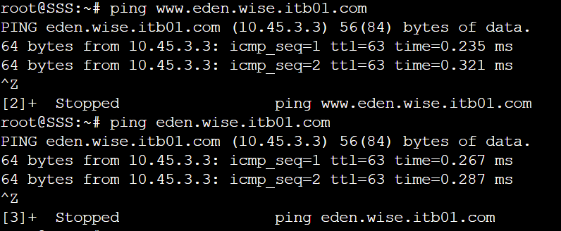
<br>

## :large_blue_circle: **Soal 4** :large_blue_circle: 
Buat juga reverse domain untuk domain utama (4).

### :triangular_flag_on_post: **Jawaban:**

### :rocket: **WISE**
Melakukan konfigurasi pada file `/etc/bind/named.conf.local`

```JavaScript
zone "wise.itb01.com" {
        type master;
        file "/etc/bind/wise/wise.itb01.com";
};

zone "2.45.10.in-addr.arpa" {
        type master;
        file "/etc/bind/wise/2.45.10.in-addr.arpa";
};
```

Mengcopy isi file db.local ke ` /etc/bind/wise/wise.itb01.com`
```JavaScript
cp /etc/bind/db.local /etc/bind/wise/wise.itb01.com
```

Melakukan konfigurasi pada file `/etc/bind/wise/2.45.10.in-addr.arpa`


```JavaScript
$TTL    604800
@       IN      SOA     wise.itb01.com. root.wise.itb01.com. (
                       20221025         ; Serial
                         604800         ; Refresh
                          86400         ; Retry
                        2419200         ; Expire
                         604800 )       ; Negative Cache TTL
;
2.45.10.in-addr.arpa. IN      NS     wise.itb01.com.
2                     IN      PTR    wise.itb01.com.
```

Merestart bind9
```JavaScript
service bind9 restart
```

### :rocket: **SSS**
Merubah nameserver ke IP Ostania agar terdapat terhubung ke internet
```JavaScript
echo nameserver 192.168.122.1 > /etc/resolv.conf
```

Mengupdate package
```JavaScript
apt-get update
```

Menginstal DNS Utils
```JavaScript
apt-get install dnsutils
```

Merubah nameserver agar merujuk WISE
```JavaScript
echo nameserver 10.45.2.2 > /etc/resolv.conf
```

### :rocket: **Testing di SSS**
```JavaScript
host -t PTR 10.45.2.2
```
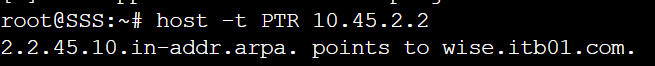
<br>

## :large_blue_circle: **Soal 5** :large_blue_circle: 
Agar dapat tetap dihubungi jika server WISE bermasalah, buatlah juga Berlint sebagai DNS Slave untuk domain utama (5).

### :triangular_flag_on_post: **Jawaban:**

### :rocket: **WISE**

Melakukan konfigurasi pada file `/etc/bind/named.conf.local`

```JavaScript
zone "wise.itb01.com" {  
        type master;
        notify yes;
        also-notify {10.45.3.2;};  
        allow-transfer {10.45.3.2;}; 
        file "/etc/bind/wise/wise.itb01.com";
};

zone "2.45.10.in-addr.arpa" {
        type master;
        file "/etc/bind/wise/2.45.10.in-addr.arpa";
};
```

Merestart bind9
```JavaScript
service bind9 restart
```

### :rocket: **Berlint**

Melakukan update package dan install bind9
```JavaScript
apt-get update
apt-get install bind9 -y
```

Konfigurasi pada file `/etc/bind/named.conf.local`

```JavaScript
zone "wise.itb01.com" {
        type slave;
        masters {10.45.2.2;};
        file "/var/lib/bind/wise.itb01.com";
};
```

Merestart bind9
```JavaScript
service bind9 restart
```

### :rocket: **Testing di SSS**

Melakukan konfigurasi di file ` /etc/resolv.conf`
```JavaScript
nameserver 10.45.2.2
nameserver 10.45.3.2
```

Melakukan ping
```JavaScript
ping wise.itb01.com
```

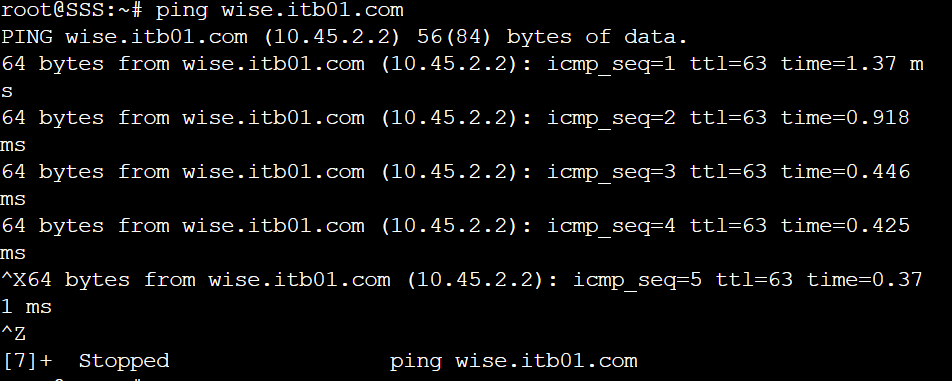
<br>

## :large_blue_circle: **Soal 6** :large_blue_circle: 
Karena banyak informasi dari Handler, buatlah subdomain yang khusus untuk operation yaitu operation.wise.yyy.com dengan alias www.operation.wise.yyy.com yang didelegasikan dari WISE ke Berlint dengan IP menuju ke Eden dalam folder operation (6).

### :triangular_flag_on_post: **Jawaban:**

### :rocket: **WISE**
Melakukan konfigurasi terhadap file `/etc/bind/wise/wise.itb01.com`
```JavaScript
$TTL    604800
@       IN      SOA     wise.itb01.com. root.wise.itb01.com. (
                       20221025         ; Serial
                         604800         ; Refresh
                          86400         ; Retry
                        2419200         ; Expire
                         604800 )       ; Negative Cache TTL
;
@       IN      NS      wise.itb01.com.
@       IN      A       10.45.2.2
www     IN      CNAME   wise.itb01.com.
@       IN      AAAA    ::1
eden    IN      A       10.45.3.3
www.eden IN     CNAME   eden.wise.itb01.com.
ns1     IN      A       10.45.3.2
operation IN    NS      ns1
```

Mengedit file ` /etc/bind/named.conf.options` menjadi sebagai berikut.
```JavaScript
//dnssec-validation auto; dicomment 

allow-query{any;}; //ditambahin 
```

### :rocket: **Berlint**
Mengedit file ` /etc/bind/named.conf.options` menjadi sebagai berikut.
```JavaScript
//dnssec-validation auto; dicomment 

allow-query{any;}; //ditambahin 
```

Melakukan konfigurasi kembali pada file `/etc/bind/named.conf.local`
```JavaScript
zone "wise.itb01.com" {
        type slave;
        masters {10.45.2.2;};
        file "/var/lib/bind/wise.itb01.com";
};

zone "operation.wise.itb01.com" {
        type master;
        file "/etc/bind/operation/operation.wise.itb01.com";
};
```

Membuat direktori
```JavaScript
mkdir /etc/bind/operation
```

Mengcopy isi file db.local ke ` /etc/bind/wise/wise.itb01.com`
```JavaScript
cp /etc/bind/db.local /etc/bind/wise/wise.itb01.com
```

Kemudian mengkonfigurasi file `/etc/bind/operation/operation.wise.itb01.com`
```JavaScript
$TTL    604800
@       IN      SOA     operation.wise.itb01.com. root.operation.wise.itb01.com. (
                       20221025         ; Serial
                         604800         ; Refresh
                          86400         ; Retry
                        2419200         ; Expire
                         604800 )       ; Negative Cache TTL
;
@       IN      NS      operation.wise.itb01.com.
@       IN      A       10.45.3.3
www     IN      CNAME   operation.wise.itb01.com.
@       IN      AAAA    ::1
```

Merestart bind9
```JavaScript
service bind9 restart
```

### :rocket: **Testing di SSS**
```JavaScript
ping www.operation.wise.itb01.com
```

<br>

## :large_blue_circle: **Soal 7** :large_blue_circle: 
Untuk informasi yang lebih spesifik mengenai Operation Strix, buatlah subdomain melalui Berlint dengan akses strix.operation.wise.yyy.com dengan alias www.strix.operation.wise.yyy.com yang mengarah ke Eden (7).

### :triangular_flag_on_post: **Jawaban:**

### :rocket: **Berlint**
Melakukan konfigurasi pada file `/etc/bind/operation/operation.wise.itb01.com`
```JavaScript
$TTL    604800
@       IN      SOA     operation.wise.itb01.com. root.operation.wise.itb01.com$
                       20221025         ; Serial
                         604800         ; Refresh
                          86400         ; Retry
                        2419200         ; Expire
                         604800 )       ; Negative Cache TTL
;
@       IN      NS      operation.wise.itb01.com.
@       IN      A       10.45.3.3
www     IN      CNAME   operation.wise.itb01.com.
strix   IN      A       10.45.3.3
www.strix  IN   CNAME   strix.operation.wise.itb01.com.
@       IN      AAAA    ::1
```

Merestart bind9
```JavaScript
service bind9 restart
```

### :rocket: **Testing di SSS**
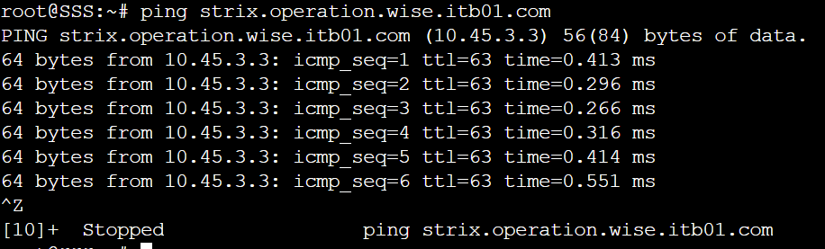


### :triangular_flag_on_post: **Jawaban:**
## :large_blue_circle: **Soal 8** :large_blue_circle: 
Setelah melakukan konfigurasi server, maka dilakukan konfigurasi Webserver. Pertama dengan webserver www.wise.yyy.com. Pertama, Loid membutuhkan webserver dengan DocumentRoot pada /var/www/wise.yyy.com (8).

### :triangular_flag_on_post: **Jawaban:**
<br>

### :rocket: **WISE**

Mengubah konfigurasi `/etc/bind/wise/wise.itb01.com` yang awalnya IP Wise menjadi IP Eden
```JavaScript
$TTL    604800
@       IN      SOA     wise.itb01.com. root.wise.itb01.com. (
                       20221025         ; Serial
                         604800         ; Refresh
                          86400         ; Retry
                        2419200         ; Expire
                         604800 )       ; Negative Cache TTL
;
@       IN      NS      wise.itb01.com.
@       IN      A       10.45.3.3 ;IP Eden
www     IN      CNAME   wise.itb01.com.
@       IN      AAAA    ::1
eden    IN      A       10.45.3.3 ;IP Eden
www.eden IN     CNAME   eden.wise.itb01.com.
ns1     IN      A       10.45.3.2 ;IP Berlint
operation IN    NS      ns1
```

Merestart bind9
```JavaScript
service bind9 restart
```

### :rocket: **Eden**

Menginstal package yang diperlukan

```JavaScript
apt-get install apache2 -y
apt-get install php -y
apt-get install unzip -y
apt-get install libapache2-mod-php7.0 -y
apt-get install ca-certificates openssl -y
apt-get install wget -y
```

Mengedit file nano /etc/apache2/sites-available/wise.itb01.com.conf

```JavaScript
<VirtualHost *:80>

        ServerAdmin webmaster@localhost
        DocumentRoot /var/www/wise.itb01.com
        ServerName wise.itb01.com
        ServerAlias www.wise.itb01.com

        <Directory /var/www/wise.itb01.com>
                Options +FollowSymLinks -Multiviews
                AllowOverride All
        </Directory>
</VirtualHost>
```

Membuat folder

```JavaScript
mkdir -p /var/www/wise.itb01.com
```

Download file ketentuan yg ada di gdrive kemudian unzip dan copy ke /var/www/wise.itb01.com

```JavaScript
mkdir -p /var/www/wise.itb01.com

wget --no-check-certificate 'https://docs.google.com/uc?export=download&id=1S0XhL9ViYN7TyCj2W66BNEXQD2AAAw2e' -O /root/wise.zip

unzip /root/wise.zip -d /root

cp -r /root/wise/. /var/www/wise.itb01.com
```

Start apache2, aktifkan configuration untuk wise.itb01.conf & reload apache

```JavaScript
service apache2 start
a2ensite wise.itb01.conf
service apache2 reload
```

### :rocket: **Testing di SSS**

Menginstal lynx

```JavaScript
apt-get install lynx -y
```

Memasukkan IP Eden ke resolv.conf -> nano /etc/resolv.conf

```JavaScript
nameserver 192.215.2.2
nameserver 192.215.3.2
nameserver 192.215.3.3
```

Lynx

```JavaScript
lynx wise.itb01.com
lynx www.wise.itb01.com
```

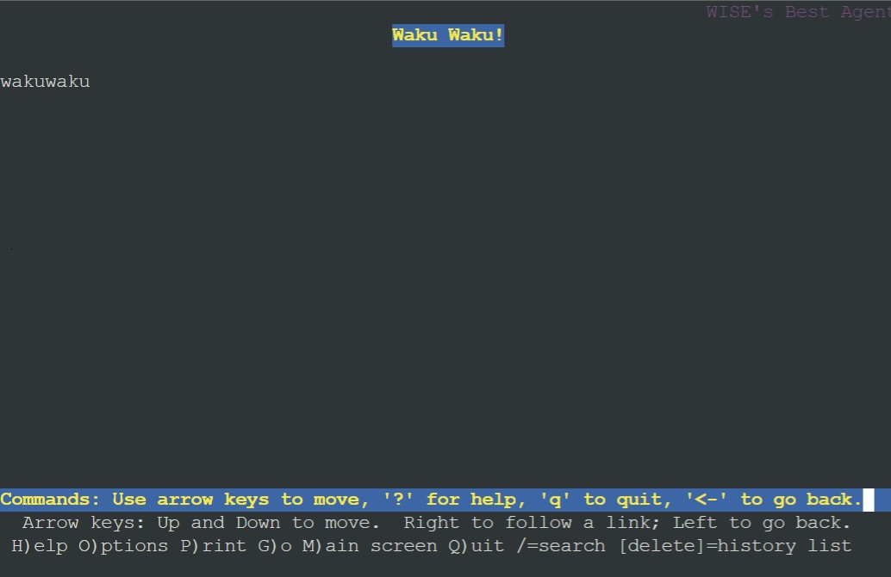
<br>

<br>

### :triangular_flag_on_post: **Jawaban:**
## :large_blue_circle: **Soal 9** :large_blue_circle: 
Setelah itu, Loid juga membutuhkan agar url www.wise.yyy.com/index.php/home dapat menjadi menjadi www.wise.yyy.com/home (9).

### :triangular_flag_on_post: **Jawaban:**
<br>

### :rocket: **Eden**

Melakukan a2enmod rewrite dan restart apache

```JavaScript
a2enmod rewrite
service apache2 restart
```

Mengkonfigurasi file nano /var/www/wise.itb01.com/.htaccess untuk melakukan pengecekan apakah request-an yang diterima ke file/direktori atau bukan, jika terpenuhi maka membuat rule yang akan mendirect ke /index.php/home. $1 ialah parameter yang diin[utkan di url konfigurasi file

```JavaScript
RewriteEngine On
RewriteCond %{REQUEST_FILENAME} !-f
RewriteCond %{REQUEST_FILENAME} !-d
RewriteRule (.*) /index.php/\$1 [L]
```

Mengkonfigurasi file nano /etc/apache2/sites-available/wise.itb01.com.conf

```JavaScript
<VirtualHost *:80>

        ServerAdmin webmaster@localhost
        DocumentRoot /var/www/wise.itb01.com
        ServerName wise.itb01.com
        ServerAlias www.wise.itb01.com

        <Directory /var/www/wise.itb01.com>
                Options +FollowSymLinks -Multiviews
                AllowOverride All
        </Directory>
</VirtualHost>
```

Restart apache
```JavaScript
service apache2 restart
```

### :rocket: **Testing di SSS**

Memasukkan IP Eden ke nano /etc/resolv.conf

```JavaScript
nameserver 192.215.2.2
nameserver 192.215.3.2
nameserver 192.215.3.3
```

Lynx

```JavaScript
lynx wise.itb01.com/home
lynx www.wise.itb01.com/home
```

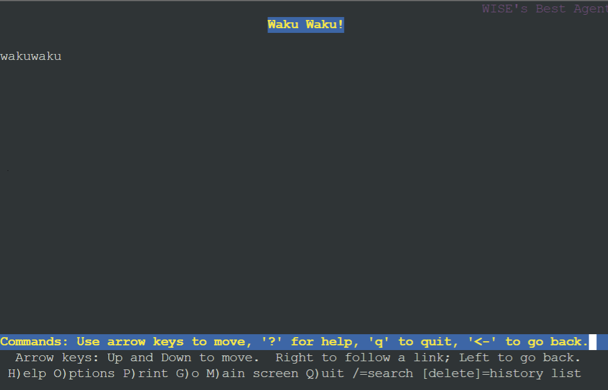
<br>

## :large_blue_circle: **Soal 10** :large_blue_circle: 
Setelah itu, pada subdomain www.eden.wise.yyy.com, Loid membutuhkan penyimpanan aset yang memiliki DocumentRoot pada /var/www/eden.wise.yyy.com (10).

### :triangular_flag_on_post: **Jawaban:**
<br>

### :rocket: **Eden**

Melakukan konfigurasi pada file /etc/apache2/sites-available/eden.wise.itb01.com.conf
```
<VirtualHost *:80>
        ServerAdmin webmaster@localhost
        DocumentRoot /var/www/eden.wise.itb01.com
        ServerName eden.wise.itb01.com
        ServerAlias www.eden.wise.itb01.com

        ErrorLog ${APACHE_LOG_DIR}/error.log
        CustomLog ${APACHE_LOG_DIR}/access.log combined

        <Directory /var/www/eden.wise.itb01.com>
                Options +FollowSymLinks -Multiviews
                AllowOverride All
        </Directory>
</VirtualHost>
```

Mengaktifkan konfigurasi dari eden.wise.itb01.com.conf

```JavaScript
a2ensite eden.wise.itb01.com.conf
```

Reload apache

```JavaScript
service apache2 reload
```

Membuat folder eden.wise.itb01.com

```JavaScript
mkdir -p  /var/www/eden.wise.itb01.com/
```

Download & Copy ke eden.wise

```JavaScript
wget --no-check-certificate 'https://docs.google.com/uc?export=dowload&id=1q9g6nM85bW5T9f5yoyXtDqonUKKCHOTV' -O /root/eden.wise.zip
unzip /root/eden.wise.zip -d /root
cp -r /root/eden.wise/. /var/www/eden.wise.itb01.com
```

Restart apache
```JavaScript
service apache2 restart
```

### :rocket: **Testing di SSS**

Memasukkan IP Eden ke /etc/resolv.conf

```JavaScript
nameserver 192.215.2.2
nameserver 192.215.3.2
nameserver 192.215.3.3
```

Lynx

```JavaScript
lynx eden.wise.itb01.com
lynx www.eden.wise.itb01.com
```

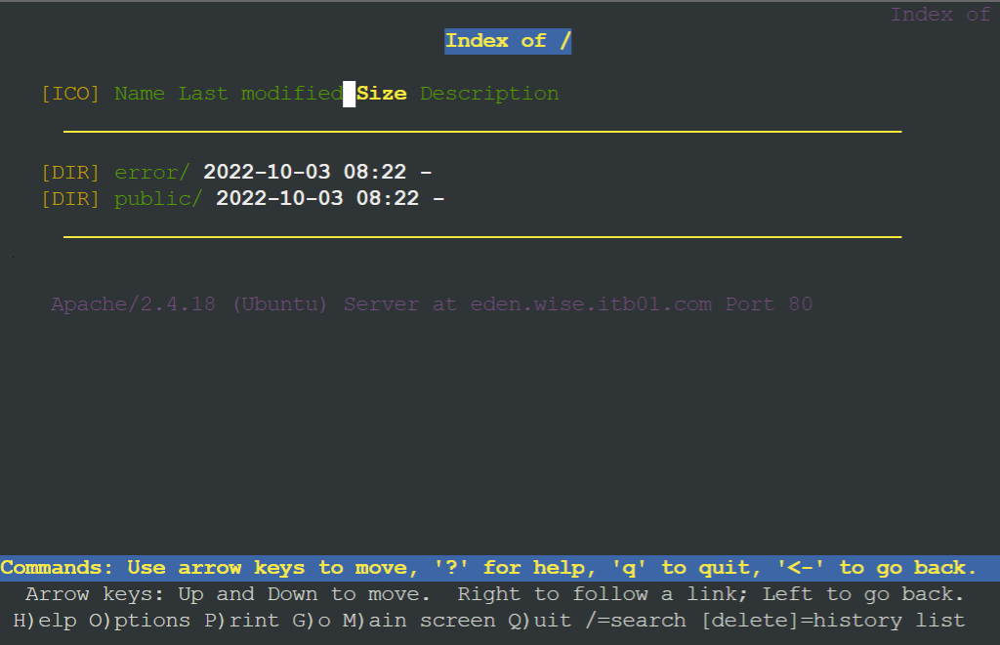
<br>

## :large_blue_circle: **Soal 11** :large_blue_circle: 
Akan tetapi, pada folder /public, Loid ingin hanya dapat melakukan directory listing saja (11).

### :triangular_flag_on_post: **Jawaban:**
<br>

### :rocket: **Eden**

Konfigurasi terhadap file nano /etc/apache2/sites-available/eden.wise.itb01.com.conf

```JavaScript
<VirtualHost *:80>
        ServerAdmin webmaster@localhost
        DocumentRoot /var/www/eden.wise.itb01.com
        ServerName eden.wise.itb01.com
        ServerAlias www.eden.wise.itb01.com
 
        <Directory /var/www/eden.wise.itb01.com>
                Options +FollowSymLinks -Multiviews
                AllowOverride All
        </Directory>
 
        <Directory /var/www/eden.wise.itb01.com/public>
            Options +Indexes
        </Directory>
 
        ErrorLog ${APACHE_LOG_DIR}/error.log
        CustomLog ${APACHE_LOG_DIR}/access.log combined
 
</VirtualHost>
```

Restart Apache
```JavaScript
Service apache2 restart
```

### :rocket: **Testing di SSS**

Memasukkan IP Eden ke /etc/resolv.conf

```JavaScript
nameserver 192.215.2.2
nameserver 192.215.3.2
nameserver 192.215.3.3
```

Lynx

```JavaScript
lynx eden.wise.itb01.com/public
```

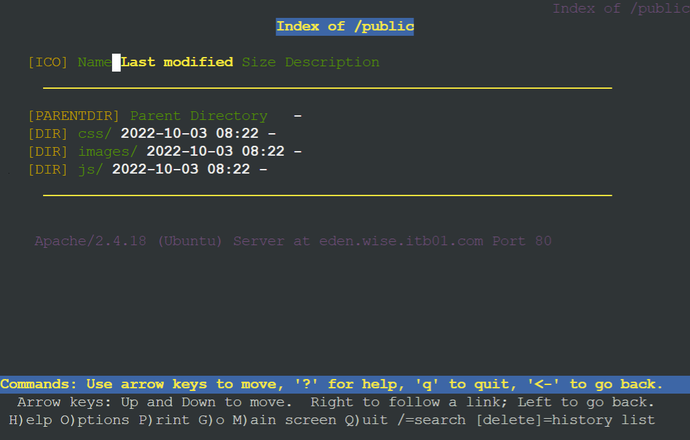
<br>


## :large_blue_circle: **Soal 12** :large_blue_circle: 
Tidak hanya itu, Loid juga ingin menyiapkan error file 404.html pada folder /error untuk mengganti error kode pada apache (12).

### :triangular_flag_on_post: **Jawaban:**
<br>

## :large_blue_circle: **Soal 13** :large_blue_circle: 
Loid juga meminta Franky untuk dibuatkan konfigurasi virtual host. Virtual host ini bertujuan untuk dapat mengakses file asset www.eden.wise.yyy.com/public/js menjadi www.eden.wise.yyy.com/js (13).

### :triangular_flag_on_post: **Jawaban:**
<br>

## :large_blue_circle: **Soal 14** :large_blue_circle: 
Loid meminta agar www.strix.operation.wise.yyy.com hanya bisa diakses dengan port 15000 dan port 15500 (14)

### :triangular_flag_on_post: **Jawaban:**
<br>

## :large_blue_circle: **Soal 15** :large_blue_circle: 
Dengan autentikasi username Twilight dan password opStrix dan file di /var/www/strix.operation.wise.yyy (15)

### :triangular_flag_on_post: **Jawaban:**
<br>

## :large_blue_circle: **Soal 16** :large_blue_circle: 
Dan setiap kali mengakses IP Eden akan dialihkan secara otomatis ke www.wise.yyy.com (16).

### :triangular_flag_on_post: **Jawaban:**
<br>

## :large_blue_circle: **Soal 17** :large_blue_circle: 
Karena website www.eden.wise.yyy.com semakin banyak pengunjung dan banyak modifikasi sehingga banyak gambar-gambar yang random, maka Loid ingin mengubah request gambar yang memiliki substring “eden” akan diarahkan menuju eden.png. Bantulah Agent Twilight dan Organisasi WISE menjaga perdamaian! (17)

### :triangular_flag_on_post: **Jawaban:**
<br>


## :large_blue_circle: **Kesulitan dan Revisi** :large_blue_circle: 
kesulitan terletak pada nomor 6 sampai 17 yang mengakibatkan kurang maksimalnya pada saat demo praktikum 
